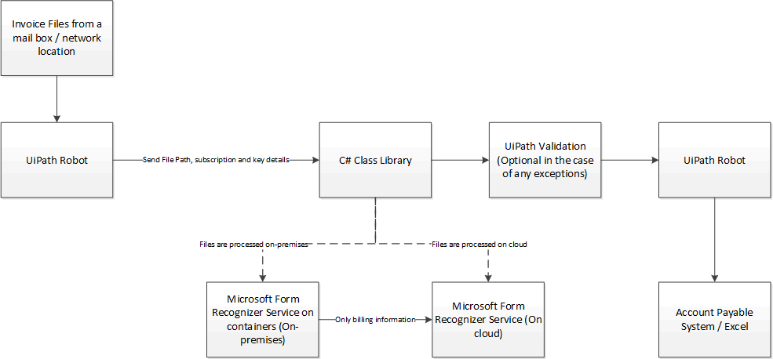

# CognitiveInvoice
**1. Why do I need to use an RPA tool?**

RPA tool comes with many capabilities that can increase productivity tremendously compared to code written to achieve the same functionality. With respect to invoice processing specifically, an RPA tool can help in interacting with sources such as taking attachments from emails with pre-defined rules, taking files from locations such as SharePoint folders or blob stores. It also can help to post the invoice details to an Account Payable system such as SAP, Microsoft Dynamics, JD Edwards etc. Achieving the same thing with code requires lot of effort.

**2. Why do I need to use Azure Form Recognizer cognitive service when an RPA tool provides a facility to read PDF files?**

It is true that an RPA tool provides functionality to read and process PDF files, it is cumbersome to process and difficult to maintain the logic as more and more vendors are added to the system and each vendor sends their invoices in their own format.

**3. We have more than 100 vendors and each vendor has their own format to send their invoices. We cannot restrict them to send the invoices in one standardize format. What is an efficient way to solve this problem?**

It is a common scenario that exists with any medium to large company. The following can be one of the easiest and working solution.

1. Even though the invoices come from multiple vendors, the information from all these invoices will need to be entered into the same Account Payable system. So, let us start from that end. Identify all the fields that are needed from the Account Payables invoice entry screen.
2. Map the fields in each vendor's invoice to the fields of the invoice entry screen.
3. Use Azure Form Recognizer cognitive service to train each vendor's invoice by providing 5 prior invoices and get the model id
4. Based on source logic (such as inbox folders, incoming email address, SharePoint folders, FTP folders etc.), provide model id and file path to the .NET library
5. The .NET library will take the invoice file, model id and converts the output from the Azure Form recognizer to a common format and provide the JSON to the RPA tool.
6. The RPA tool takes this common format fields and enters the invoice information into invoice entry screen of the Account Payable system.

